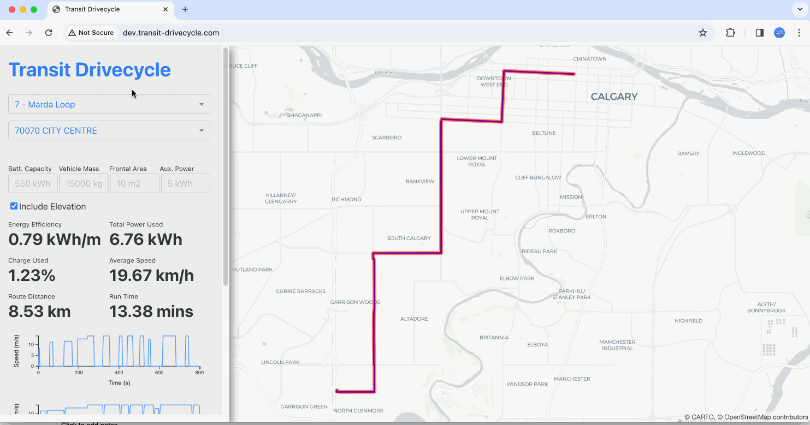

## Transit Drivecyle

Transit Drivecycle creates a visualization of bus velocity profiles, energy consumption and state of charge using the [Drivecycle](https://github.com/smohiudd/drivecycle) python library and [OSM data](https://www.openstreetmap.org/#map=2/71.3/-96.8).



### Project Setup

**The GTFS data used in this project must have the `shape_dist_traveled` field to get linearly reference stop distances.**

#### Download OSM Data

Download OSM data from [geofabrik](https://download.geofabrik.de/) and save in `/valhalla/data`. This will be used to generate the routing graph in Valhalla. If needed you can clip your pbf file using [Osmium](https://osmcode.org/osmium-tool/).

#### Convert GTFS CSV to Parquet

Since we are using DuckDb-Wasm for the joining GTFS tables in the browser, we'll need to convert the GTFS csv files to Parquet. See [this notebook](./notebooks/geoparquet.ipynb) for more information on using Pandas to convert csv to Parquet. Parquet files must be stored in an S3 bucket and referenced in `frontend/src/parquet_files.js`

#### Optional GTFS Database using `gtfs-postgres`

If you would like to setup a traditional PostGIS/PostGres database instead of using DuckDb then you can use [gtfs-via-postgres](https://github.com/public-transport/gtfs-via-postgres) to ingest GTFS. This will require changes to the API in `drivecycleapi` to connect to the db (not currently implemented).

### Run Locally

#### Run Dev

```bash
docker compose -f docker-compose-dev.yml up frontend-dev
```

#### Run Production

```
docker compose up
```

In a production environment Valhalla tiles must be built before copying to the production Valhalla container. The following should be included in Valhalla:

```
valhalla/
    elevation_data/
    valhalla_tiles.tar
```

### Deploy Using AWS Fargate

CDK is used to deploy to AWS Fargate. To install deploy python requirements, run:

```
pip install -r requirements.txt
```

After installing the [CDK cli](https://docs.aws.amazon.com/cdk/v2/guide/cli.html), deploy to AWS using the following:

```
cdk deploy
```

#### AWS Architecture

The project uses a micro services architecture deployed to ECS using Fargate with a separate task definitions for each service. [Service Connect](https://docs.aws.amazon.com/AmazonECS/latest/developerguide/service-connect.html) is used for for inter-container networking using hostnames similar to Docker networks. A single Application Load Balancer is used to route traffic.


